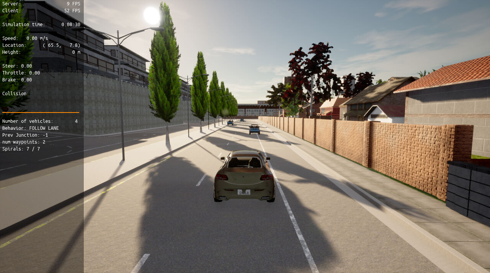
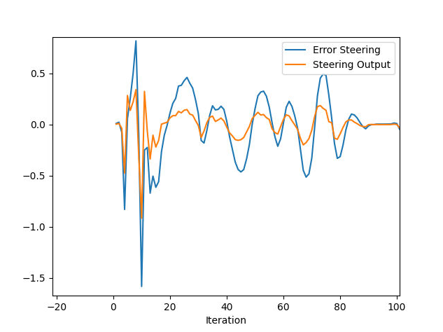
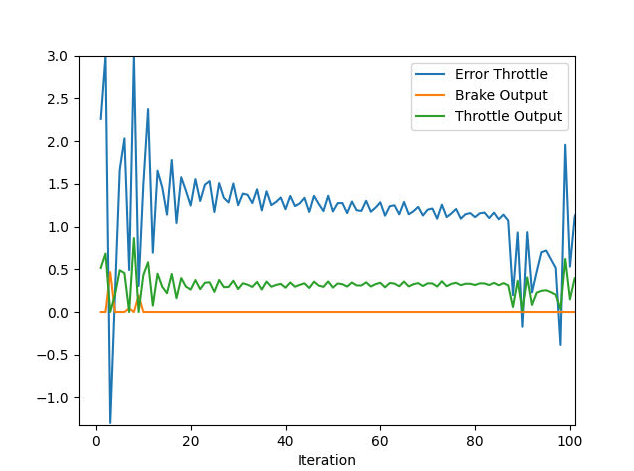

# Control-and-Trajectory-Tracking-for-Autonomous-Vehicles
## Project Description
In this project it has to be designed a PID controller to perform vehicle trajectory tracking. Given a trajectory as an array of locations, and a simulation environment (the vehicle with possible perturbations), a PID controller has to be designed, coded and tested its efficiency on the CARLA simulator used in the industry.

 * the Behavior Planner
 * the Motion Planner. 
 
## Step 1: Build the PID controller object
Complete the TODO in the pid_controller.h and pid_controller.cpp.
Here's a screenshot of the CARLA simulator.

## Step 2: PID controller for throttle
* In [main.cpp](Code/main.cpp), complete the TODO (step 2) to compute the error for the throttle pid. The error is the speed difference between the actual speed and the desired speed.
* Comment your code to explain why did you computed the error this way.
* Tune the parameters of the pid until you get satisfying results (a perfect trajectory is not expected).
## Step 3: PID controller for steer
* In [main.cpp](Code/main.cpp), complete the TODO (step 3) to compute the error for the steer pid. The error is the angle difference between the actual steer and the desired steer to reach the planned position.
* Comment your code to explain why did you computed the error this way.
* Tune the parameters of the pid until you get satisfying results (a perfect trajectory is not expected).
 ## Step 4: Evaluate the PID efficiency

- Add the plots to your report and explain them (describe what you see)
  - lala
- What is the effect of the PID according to the plots, how each part of the PID affects the control command?
  - lala 
- How would you design a way to automatically tune the PID parameters?
  - lala
- PID controller is a model free controller, i.e. it does not use a model of the car. Could you explain the pros and cons of this type of controller?
  - lala

## Reference code
[main.cpp](Code/main.cpp)
 
[pid_controller.cpp](Code/pid_controller.cpp)
 
[pid_controller.h](Code/pid_controller.h)

